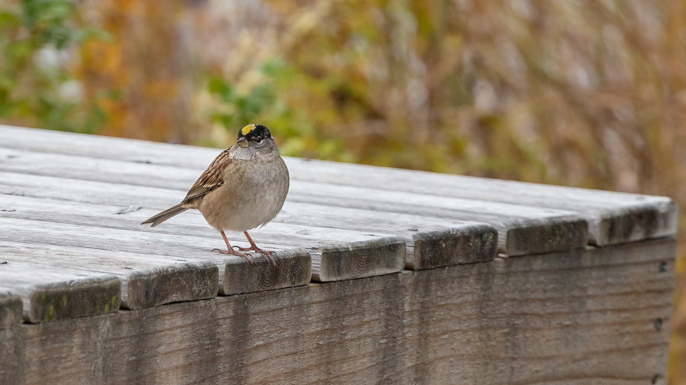
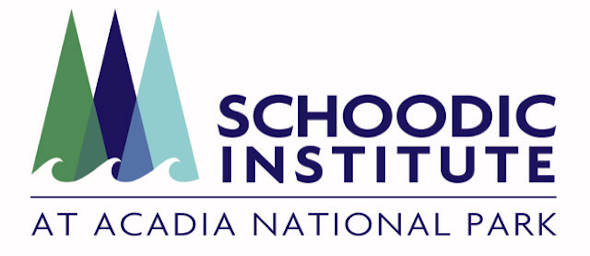

```{r echo = FALSE, include = FALSE}
library(tidyverse)
library(lubridate)
library(kableExtra)
library(htmltools)
library(sf)
library(gt)
source("email_alerts/email_functions.R")

end <- format(today() - 1, "%d %B %Y")
date <- as.Date(end, format = "%d %B %Y")
start <- paste("1", format(date, "%B"), year(date))

## Pull iNaturalist and eBird data
inat <- inat_recent("month")
#inat <- read.csv("outputs/test.csv")

## Read in review list for filtering
rlist <- read.csv("outputs/final_review_species_list.csv")


## Filter iNat data to review species observations only
finaldat <- inat %>% 
  filter(scientific.name %in% rlist$scientific.name) %>% 
  select(scientific.name, common.name, location = place.guess, observed.on, url) %>% 
  mutate(link = glue::glue("[view observation]({url})"),
         link = map(link, gt::md)) %>%
  select(-url) %>% 
  arrange(common.name, observed.on)


```


<!-- Header -->
<div class = "title-box">
  <div class = "titlemain">
  ME-BRC iNaturalist Review Species Report
  </div>
  <div class = "subtitle"> 
  `r start` - `r end`
  </div>
</div>


<div class = "titleslide">
  
</div>


<!-- Introduction -->
<div class = "intro-box">
  <div class = "body-title-box">
  <i class = "body-box-icon"></i>
  <h4 class = "body-titles"> Introduction </h4>
  </div>
  <div class = "intro-img-box">
  <a href = "https://www.inaturalist.org/"></a>
  
  </div>
  <div class = "intro-text">
  Welcome to the monthly report of iNaturalist observations of species on the Maine Bird Records Committee review list. These are observations submitted from `r start` to `r end` from within the boundaries of the state. 
  
  The observations in this report come from an open source citizen science project called iNaturalist. The records here are both casual and research grade observations, so erroneous identifications are very possible. This project is adapted from products made by Schoodic Institute at Acadia National Park.
  </div>
</div>


<!-- Pests & Invasives -->
<div class = "rare-box">
  <div class = "body-title-box">
  <h4 class = "body-titles"> Review species this month </h4>
  </div>
  
  <div class = "rare-table">
  `r ifelse(length(finaldat$scientific.name) > 0, kbl(finaldat) %>% kable_styling(bootstrap_options = "hover"), paste0("<h3> There were no review species observed this month. </h3>"))`
  </div>
</div>


<!-- Credits -->
<div class = "credits-box">
  <div>
  <a href = "https://schoodicinstitute.org/"></a>
  
  © `r year(today())` Kyle Lima, adapted from products made by Schoodic Institute
  </div>
  <div> 
  <b>Data Citations:</b>

  iNaturalist. Available from <a href = "https://www.inaturalist.org/" target =                         "_blank"> https://www.inaturalist.org. </a> `r paste0("Accessed [", today(), "].")`
  
  <br>
  
  <b>Photo Credits:</b>
  
  Background art of the Rock Wren © Doug Hitchcox.
  
  Golden-crowned Sparrow photo © Louis Bevier
  
</div>
